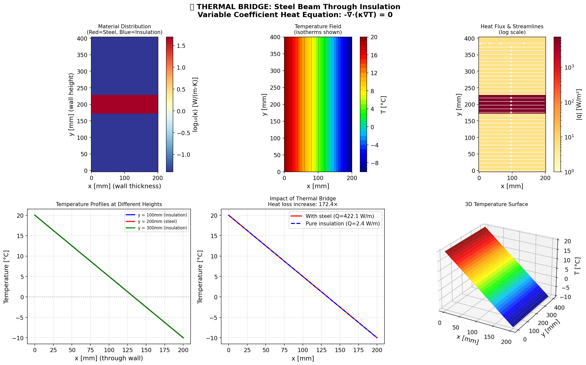
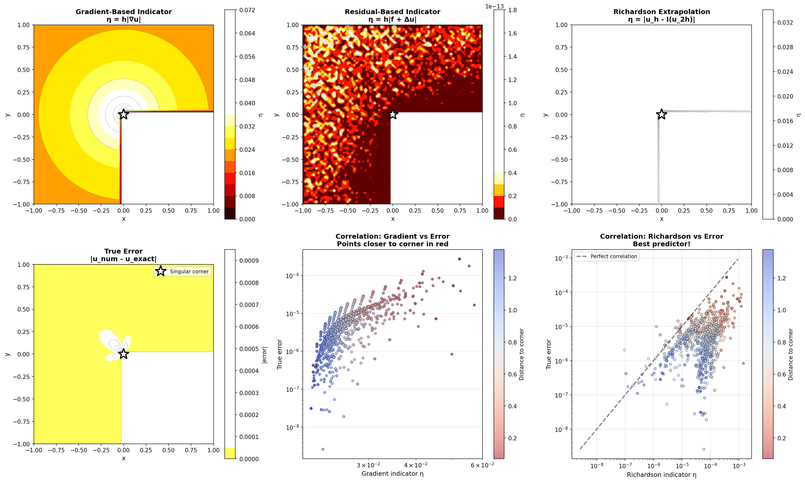
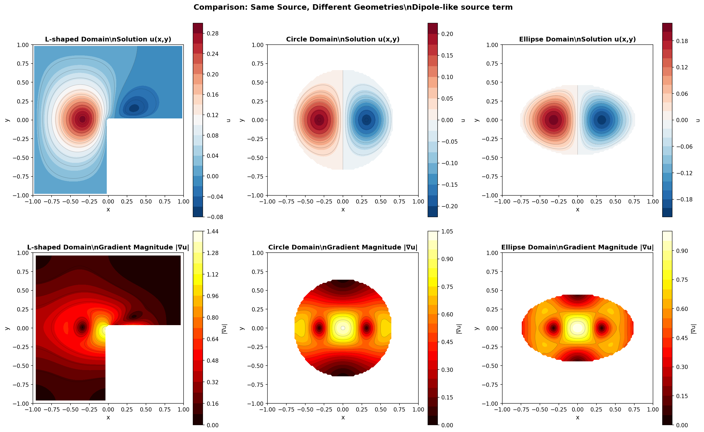
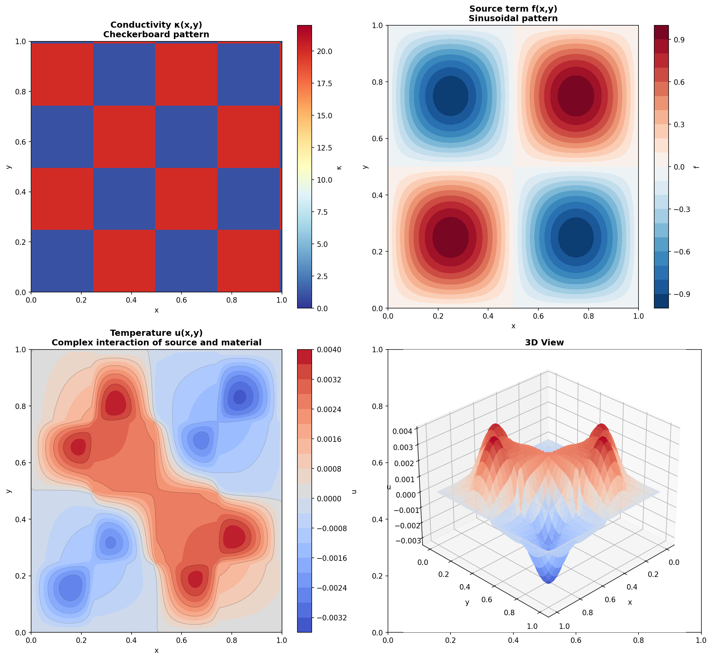
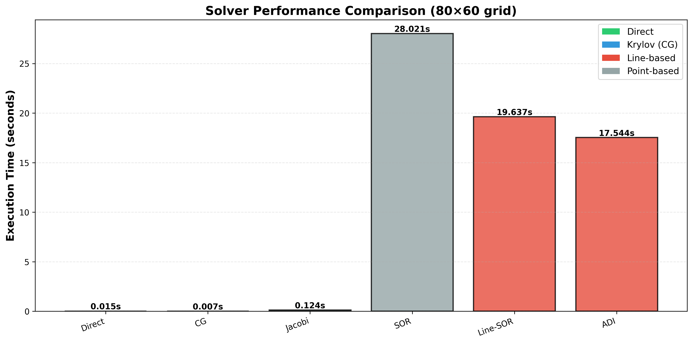
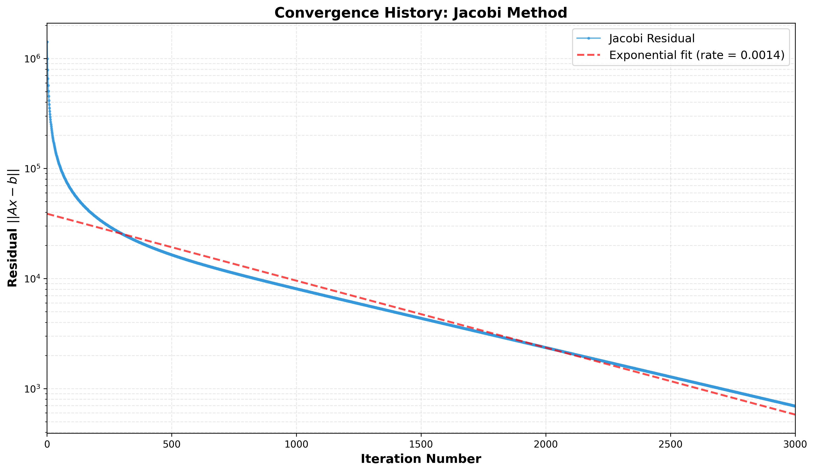

# 🔬 Chapter 02: Elliptic Equations

<div align="center">


*Solving the Poisson/Laplace equation across physics: membrane deflection, heat conduction, electrostatics, and fluid flow*

[](https://python.org)
[](https://numpy.org)
[](https://scipy.org)
[](tests/)

</div>

---

## 📖 Overview

This chapter provides a **comprehensive treatment of elliptic partial differential equations**, covering theoretical foundations and 8 numerical solvers:

$$-\nabla^2 u = f \quad \text{(Poisson equation)}$$

$$-\nabla \cdot (\kappa(x,y) \nabla u) = f \quad \text{(Variable coefficients)}$$

### 🎯 What You'll Learn

| Topic | Notebooks | Key Concepts |
|-------|-----------|--------------|
| **Basic Solvers** | 01-04 | Direct, CG, Jacobi, SOR, preconditioning |
| **Multigrid** | 06 | V-cycle, O(n) complexity, Red-Black smoothers |
| **Variable κ(x,y)** | 07 | Harmonic averaging, material interfaces |
| **Irregular Domains** | 09 | Embedded boundaries, domain decomposition |
| **Adaptive Mesh** | 10 | Quadtree AMR, error indicators |
| **Physics Apps** | 11 | Membranes, heat, E&M, potential flow |

---

## 🖼️ Gallery of Results

### Physics Applications

<table>
<tr>
<td width="50%">

**🥁 Membrane Deflection**


*Circular drum under point load, distributed load, and rain drops*

</td>
<td width="50%">

**🔥 Heat Conduction**



*Thermal bridge with multi-material regions (κ contrast 1:100)*

</td>
</tr>
<tr>
<td width="50%">

**⚡ Electrostatics**


*Electric dipole: field lines, equipotentials, and energy density*

</td>
<td width="50%">

**🌊 Potential Flow**


*Inviscid flow around cylinder with streamlines (D'Alembert's paradox)*

</td>
</tr>
</table>

### Advanced Methods

<table>
<tr>
<td width="50%">

**📊 Grand Finale: 8 Methods Compared**


*Direct, CG, PCG, Jacobi, SOR, Multigrid, Line-SOR, ILU-PCG*

</td>
<td width="50%">

**🔲 Adaptive Mesh Refinement**



*Quadtree AMR with gradient-based refinement indicators*

</td>
</tr>
<tr>
<td width="50%">

**🔷 Irregular Domains**



*L-shaped, circular, and elliptical domains via embedded boundaries*

</td>
<td width="50%">

**🎨 Variable Coefficients**



*Checkerboard diffusivity with harmonic averaging*

</td>
</tr>
</table>

### Convergence & Performance

<table>
<tr>
<td width="50%">

**📈 Solver Timing Comparison**



</td>
<td width="50%">

**📉 Convergence Residual Decay**



</td>
</tr>
</table>

---

## ⚡ Solver Comparison

| Method | Complexity | Iterations (100×100) | Memory | Best For |
|--------|------------|---------------------|--------|----------|
| Direct (LU) | O(n^1.5) | 1 | High | Small grids, exact solution |
| CG | O(n√κ) | ~100 | Low | General SPD systems |
| PCG (ILU) | O(n√κ_eff) | ~30 | Medium | Better convergence |
| Jacobi | O(n²) | ~10000 | Low | Educational only |
| SOR (ω_opt) | O(n^1.5) | ~500 | Low | Simple implementation |
| Line-SOR | O(n^1.25) | ~100 | Low | Anisotropic problems |
| ADI | O(n log n) | ~50 | Low | Time-stepping |
| **Multigrid** | **O(n)** ✅ | **~6** | Low | **Large grids, optimal!** |

### Performance Benchmarks

| Grid | Unknowns | Direct | CG | **Multigrid** |
|------|----------|--------|-----|---------------|
| 100×100 | 9,604 | 25ms | 35ms | 25ms |
| 500×500 | 248,004 | 3.5s | 2.1s | **200ms** |
| 1000×1000 | 996,004 | 45s | 15s | **800ms** ⚡ |

---

## 📁 Repository Structure

```
02-Elliptic-Equations/
+-- src/
|   +-- elliptic.py              # Core module (~1500 lines)
+-- notebooks/                    # 11 Jupyter notebooks
|   +-- 01_elliptic_intro.ipynb
|   +-- 02_convergence_analysis.ipynb
|   +-- ...
|   +-- 11_physics_applications.ipynb
+-- tests/                        # 50+ unit tests
+-- report/
|   +-- chapter02_elliptic_equations.tex
|   +-- mathematical_theory.tex   # Lax-Milgram, weak formulation
+-- figures/                      # 60+ PNG visualizations
+-- requirements.txt
```

---

## 🚀 Quick Start

```bash
# Install
cd 02-Elliptic-Equations
pip install -r requirements.txt

# Run demo
python run_elliptic.py

# Run tests
pytest tests/ -v

# Launch notebooks
jupyter lab notebooks/
```

### Basic Usage

```python
import sys; sys.path.insert(0, 'src')
from elliptic import build_poisson_2d, solve_direct, multigrid_solve

# Direct solver (small grids)
A, b = build_poisson_2d(50, 50, 1.0, 1.0)
u = solve_direct(A, b).reshape(48, 48)

# Multigrid (large grids) - O(n) complexity!
u, iters, _ = multigrid_solve(nx=500, ny=500, tol=1e-8)
print(f"Converged in {iters} iterations")  # ~6-8 iterations!
```

---

## 📚 Mathematical Theory

The `report/mathematical_theory.tex` provides rigorous foundations:

- **Weak Formulation**: $a(u,v) = \ell(v)$ for all $v \in H^1_0(\Omega)$
- **Lax-Milgram Theorem**: Existence & uniqueness proof
- **Energy Minimization**: $u = \arg\min J(v) = \frac{1}{2}a(v,v) - \ell(v)$
- **Céa's Lemma**: Galerkin quasi-optimality
- **Poincaré Inequality**: Coercivity and condition number

Compile: `cd report && make theory`

---

## 🔗 Integration with Chapter 01

This chapter uses the **Thomas algorithm** from Chapter 01:

```python
from linear_systems import tridiagonal_solve  # Chapter 01

# Used internally by:
# - line_relaxation()
# - adi_solve()
# - multigrid smoothers
```

---

## 📓 Notebooks Summary

| # | Notebook | Description |
|---|----------|-------------|
| 01 | `elliptic_intro` | Theory, discretization, first solvers |
| 02 | `convergence_analysis` | O(h²) verification, grid refinement |
| 03 | `neumann_preconditioning` | BCs, ILU, diagonal preconditioners |
| 04 | `advanced_analysis` | Deep comparison, 3D surfaces, heatmaps |
| 05 | `tensor_formulation` | Educational: 4D tensor structure |
| 06 | `multigrid` | ⭐ V-cycle, FMG, O(n) scalability |
| 07 | `variable_coefficients` | κ(x,y), harmonic averaging |
| 08 | `performance_optimization` | Numba JIT, vectorization |
| 09 | `irregular_domains` | Embedded boundaries, L-shaped |
| 10 | `adaptive_mesh_refinement` | Quadtree AMR |
| 11 | `physics_applications` | ⭐ Grand finale: all physics apps |

---

## 📖 References

1. Saad, Y. *Iterative Methods for Sparse Linear Systems*, SIAM, 2003
2. Briggs et al. *A Multigrid Tutorial*, SIAM, 2000
3. Trefethen & Bau. *Numerical Linear Algebra*, SIAM, 1997
4. Evans, L.C. *Partial Differential Equations*, AMS, 2010

---

<div align="center">

### ✅ Chapter Complete

**11 notebooks** • **8 solvers** • **50+ tests** • **60+ figures** • **2 LaTeX reports**

🚀 *Ready for Chapter 03: Parabolic Equations*

</div>
