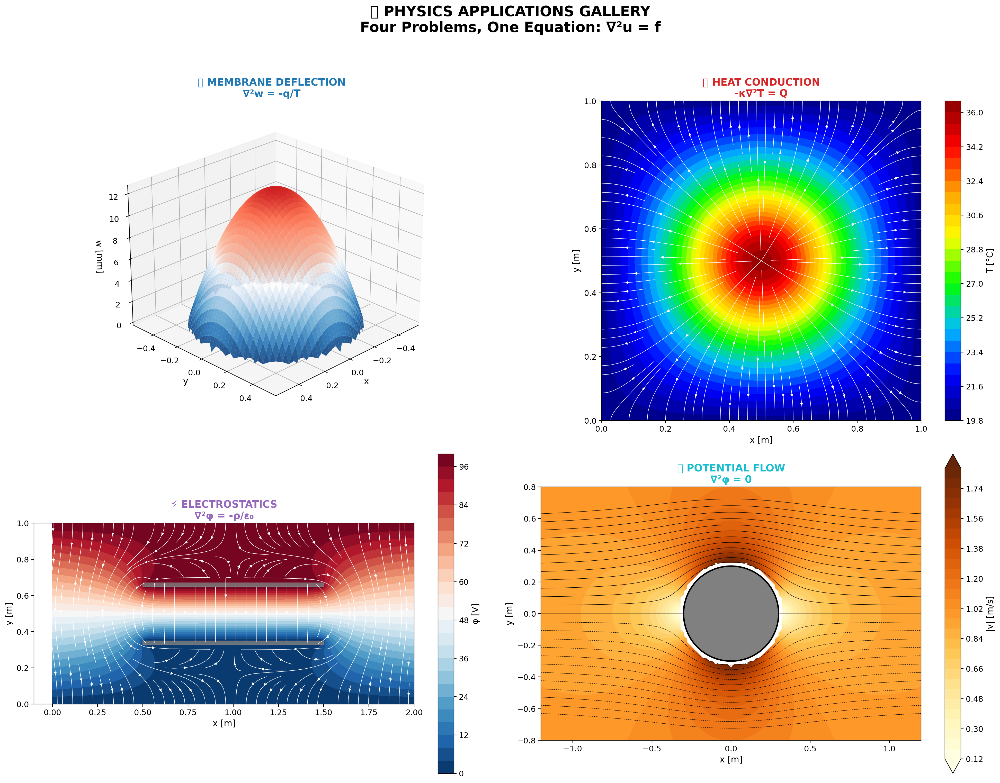
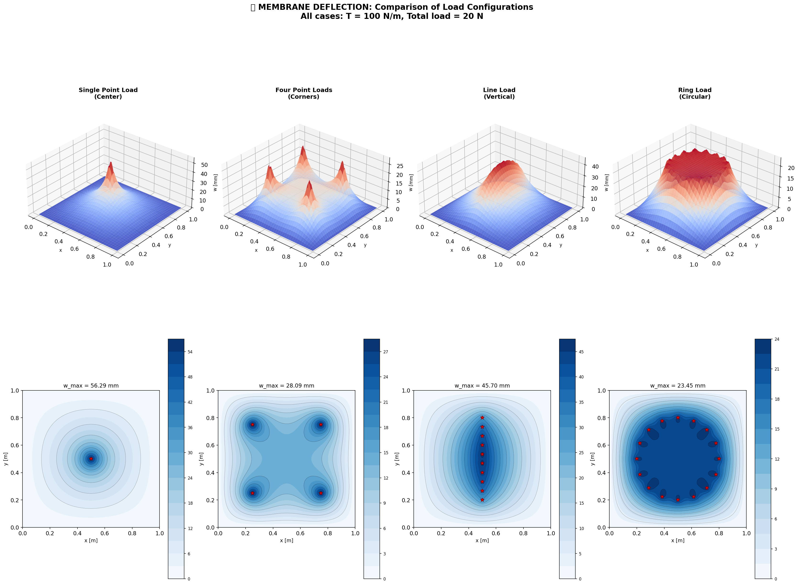
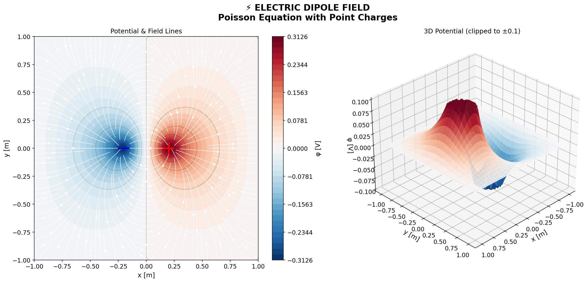
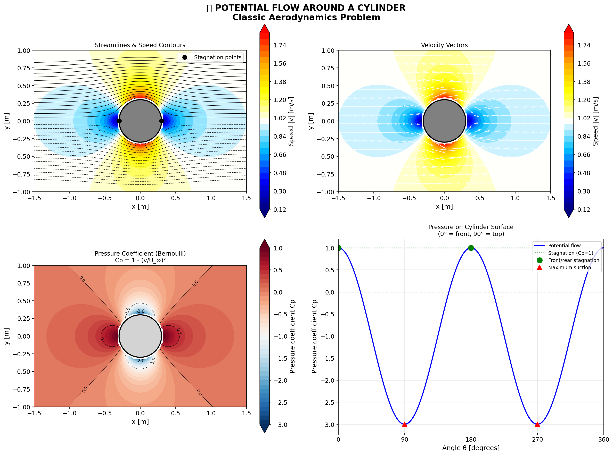
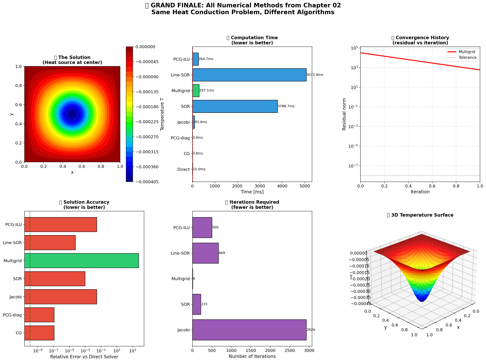

# 🔬 Computational Physics: Numerical Methods

<div align="center">



*A comprehensive collection of numerical methods for computational physics*

[](https://python.org)
[](LICENSE)
[](.)

</div>

---

## 📖 Overview

A curated collection of exercises and projects from my academic journey in computational physics. Each chapter goes beyond core coursework to provide deep understanding through:

- **Rigorous implementations** with extensive testing
- **Beautiful visualizations** for intuition
- **LaTeX reports** with mathematical foundations
- **Comprehensive Jupyter notebooks** for exploration

---

## 📚 Chapters

### Chapter 01: Linear Systems
**Tridiagonal matrices and the Thomas algorithm**

- Direct solvers for banded systems
- Thomas algorithm (O(n) complexity)
- Parallel implementations (Numba, CuPy)
- Applications to 1D boundary value problems

📁 [`01-Linear-Systems/`](01-Linear-Systems/)

---

### Chapter 02: Elliptic Equations ⭐
**Poisson and Laplace equations in 2D**

<table>
<tr>
<td width="33%">

<br><em>Membrane deflection</em>
</td>
<td width="33%">

<br><em>Electric dipole</em>
</td>
<td width="33%">

<br><em>Potential flow</em>
</td>
</tr>
</table>

**Features:**
- 🔧 **8 numerical solvers**: Direct, CG, Jacobi, SOR, Line-SOR, ADI, Multigrid, PCG
- 📊 **Multigrid methods**: O(n) optimal complexity
- 🎨 **Variable coefficients**: κ(x,y) with harmonic averaging
- 🔷 **Irregular domains**: Embedded boundary methods
- 📐 **Adaptive mesh refinement**: Quadtree-based AMR
- 🔬 **Physics applications**: Membranes, heat, E&M, fluid flow

**Contents:**
- 11 Jupyter notebooks with comprehensive analysis
- 50+ unit tests
- 2 LaTeX reports (including Lax-Milgram theorem proof)
- 60+ publication-quality figures

📁 [`02-Elliptic-Equations/`](02-Elliptic-Equations/)

---

## 🚀 Quick Start

```bash
# Clone the repository
git clone https://github.com/davidgisbertortiz-arch/Computational-Physics-Numerical-methods.git
cd Computational-Physics-Numerical-methods

# Install dependencies
pip install -r 01-Linear-Systems/requirements.txt
pip install -r 02-Elliptic-Equations/requirements.txt

# Run Chapter 02 demo
python 02-Elliptic-Equations/run_elliptic.py

# Launch notebooks
jupyter lab
```

---

## 🛠️ Technologies

| Category | Tools |
|----------|-------|
| **Core** | Python 3.8+, NumPy, SciPy |
| **Visualization** | Matplotlib, Seaborn |
| **Notebooks** | Jupyter Lab |
| **Testing** | pytest |
| **Documentation** | LaTeX |
| **Acceleration** | Numba (optional), CuPy (optional) |

---

## 📊 Highlights

### Multigrid: O(n) Optimal Solver

```python
from elliptic import multigrid_solve

# Solve 1 million unknowns in seconds!
u, iters, _ = multigrid_solve(nx=1000, ny=1000, tol=1e-10)
# Result: ~6 iterations, ~800ms
```

### Grand Finale: All Methods Compared

<div align="center">

</div>

---

## 📖 Mathematical Foundations

Each chapter includes rigorous mathematical treatment:

- **Weak formulations** and Sobolev spaces
- **Lax-Milgram theorem** for existence/uniqueness
- **Energy minimization** principles
- **Convergence analysis** with O(h²) verification

See [`02-Elliptic-Equations/report/mathematical_theory.tex`](02-Elliptic-Equations/report/mathematical_theory.tex)

---

## 🗺️ Roadmap

- [x] **Chapter 01**: Linear Systems (Thomas algorithm)
- [x] **Chapter 02**: Elliptic Equations (Poisson/Laplace)
- [ ] **Chapter 03**: Parabolic Equations (Heat equation, diffusion)
- [ ] **Chapter 04**: Hyperbolic Equations (Wave equation, advection)
- [ ] **Chapter 05**: Eigenvalue Problems
- [ ] **Chapter 06**: Monte Carlo Methods

---

## 📄 License

MIT License - see [LICENSE](LICENSE) for details.

---

<div align="center">

**Made with ❤️ for Computational Physics**

*"The purpose of computing is insight, not numbers."* — Richard Hamming

</div>
